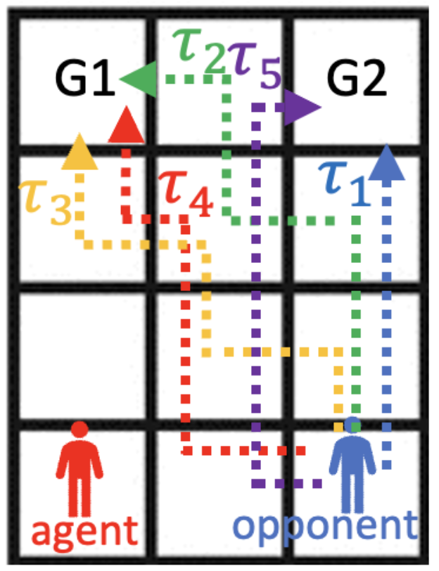

# Grid World

{ width="400" }

In Grid World, the agent with $\pi_i$ aims to reach a goal, while avoiding any collision with the opponent with $\tau_i$.

## Create the environment

```python
from grid_world.env import *
env = GridWorld()
```

## Reset the environment to initial state

```python
env.reset()
env.show()
```

The `env.show()` will print out the following result

```
1.2
...
...
△.○
```

## Move the agent

There are five moves to choose from

- `Move.UP`
- `Move.RIGHT`
- `Move.DOWN`
- `Move.LEFT`
- `Move.STANDBY`

```python
env.step(Move.RIGHT)
```

You can check the result by calling `env.show()` again.

The `env.step()` method will return the following values

```
(<done>, <reward>, <state>, <actions>)
```

`<done>` is a boolean value indicating if the game reaches an end, and `<reward>` is an integer showing the reward the agent gets.

The `<state>` return value contains

```
(agent_x, agent_y, opponent_x, opponent_y)
```

The `<actions>` return value contains

```
(agent_action, opponent_action)
```

For instance, `env.step()` could return the following values

```
(True, 30, (0, 3, 2, 3), (<Move.STANDBY: 4>, <Move.LEFT: 3>))
```

## Change the opponent policy

There are five policies to choose from

- `Opponent.Policy.ONE`
- `Opponent.Policy.TWO`
- `Opponent.Policy.THREE`
- `Opponent.Policy.FOUR`
- `Opponent.Policy.FIVE`

Set the policy using the following code (`env` being the `GridWorld` environment)

```python
env.opponent.policy = Opponent.Policy.ONE
```

You will see the following message printing on the console

```
Opponent policy is Policy.ONE
```

## Change the agent policy

To set a policy, your agent has to be a `BprAgent`, see `BprAgent` in [`grid_world/agent.py`](https://github.com/jerry871002/bayesian-strategy-inference/blob/master/src/grid_world/agent.py)

There are five policies to choose from

- `BprAgent.Policy.ONE`
- `BprAgent.Policy.TWO`
- `BprAgent.Policy.THREE`
- `BprAgent.Policy.FOUR`
- `BprAgent.Policy.FIVE`

Set the policy using the following code (`env` being the `GridWorld` environment)

```python
env.agent.policy = BprAgent.Policy.ONE
```

You will see the following message printing on the console

```
BprAgent policy is Policy.ONE
```
