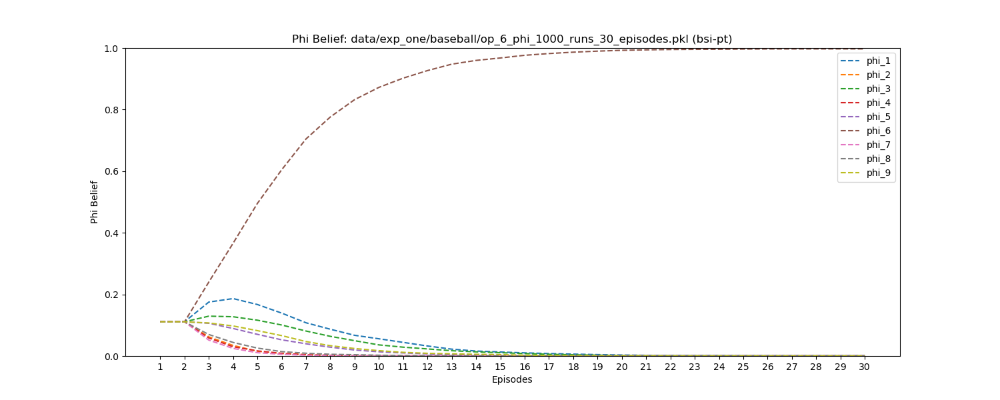
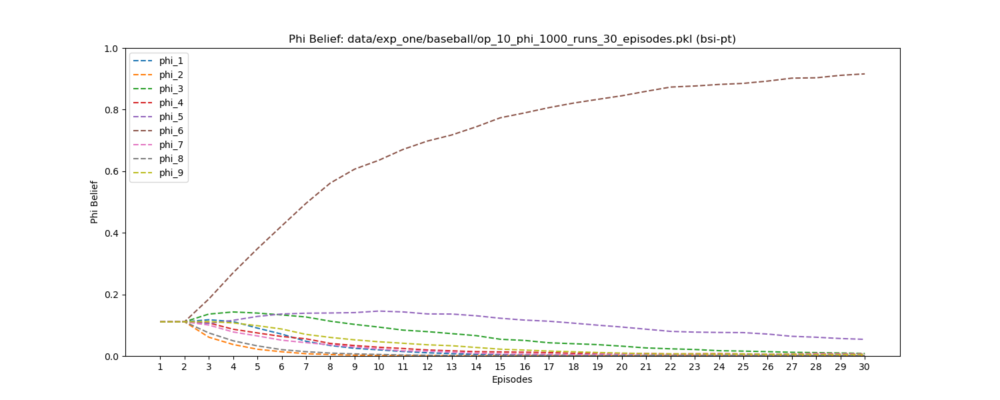
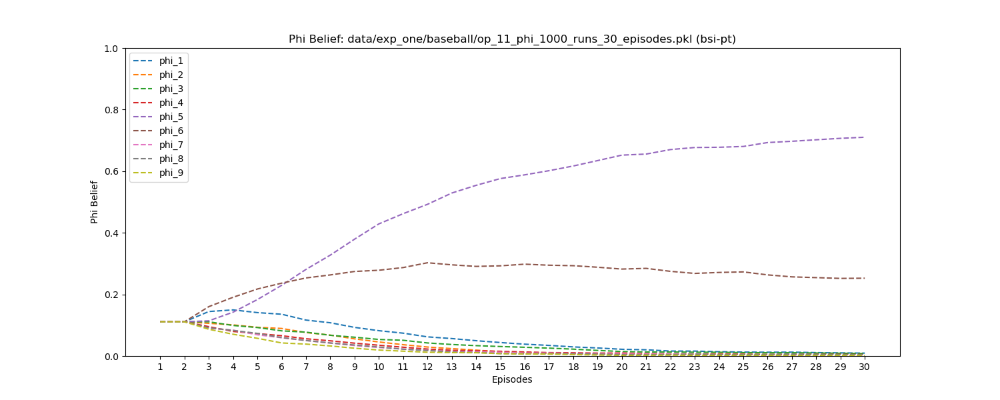
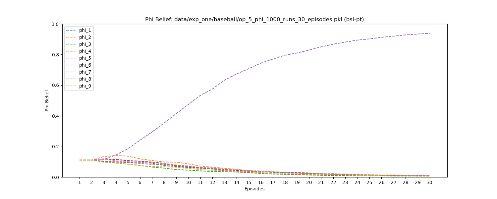

# Experiment 1 Figures

!!! tip
    Click the figure to view in fullscreen.

!!! warning
    The figures are generated by running only 1,000 runs for each experiment, so the figures may not be exactly the same as the ones in the paper.

## Figure 3 in the paper

BSI-PT’s $\phi$ estimation against the pitcher with $\omega_6$, $\omega_{10}$, $\omega_{11}$, $\omega_5$

<figure markdown>
  
  <figcaption>BSI-PT against $\omega_6$</figcaption>
</figure>

<figure markdown>
  
  <figcaption>BSI-PT against $\omega_{10}$</figcaption>
</figure>

<figure markdown>
  
  <figcaption>BSI-PT against $\omega_{11}$</figcaption>
</figure>

<figure markdown>
  
  <figcaption>BSI-PT against $\omega_5$</figcaption>
</figure>
