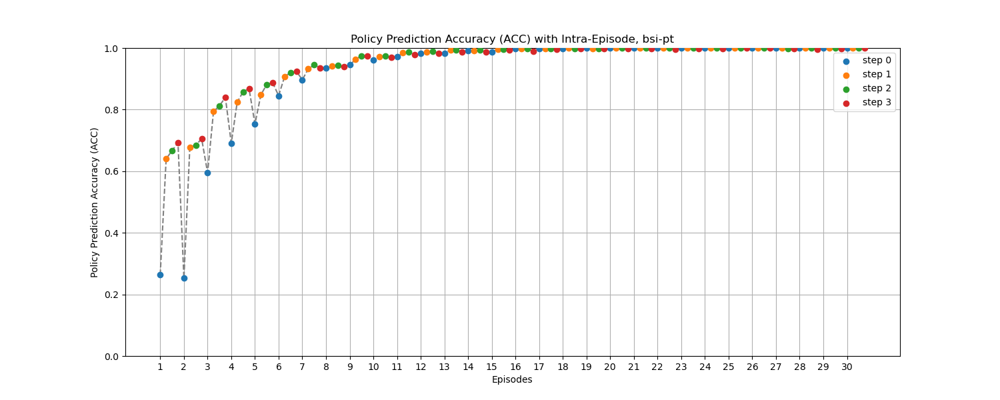

# Experiment 2 Figures

!!! tip
    Click the figure to view in fullscreen.

!!! warning
    The figures are generated by running only 1,000 runs for each experiment, so the figures may not be exactly the same as the ones in the paper.

## Figure 4 in the paper

$\tau$ prediction accuracy (ACC) along inter and intra episodes of BSI-PT and Bayes-OKR against the pitcher with $\omega_6$, $\omega_{10}$, $\omega_{11}$, $\omega_5$

<figure markdown>
  
  <figcaption>BSI-PT against $\omega_6$</figcaption>
</figure>

<figure markdown>
  
  <figcaption>Bayes-OKR against $\omega_6$</figcaption>
</figure>

<figure markdown>
  
  <figcaption>BSI-PT against $\omega_{10}$</figcaption>
</figure>

<figure markdown>
  
  <figcaption>Bayes-OKR against $\omega_{10}$</figcaption>
</figure>

<figure markdown>
  
  <figcaption>BSI-PT against $\omega_{11}$</figcaption>
</figure>

<figure markdown>
  
  <figcaption>Bayes-OKR against $\omega_{11}$</figcaption>
</figure>

<figure markdown>
  
  <figcaption>BSI-PT against $\omega_5$</figcaption>
</figure>

<figure markdown>
  
  <figcaption>Bayes-OKR against $\omega_5$</figcaption>
</figure>

## Figure 5 in the paper

Winning percentage (WP) of BSI-PT and Bayes-OKR against the pitcher with $\omega_6$, $\omega_{10}$, $\omega_{11}$, $\omega_5$

<figure markdown>
  
  <figcaption>BSI-PT Winning percentage (WP)</figcaption>
</figure>

<figure markdown>
  
  <figcaption>Bayes-OKR Winning percentage (WP)</figcaption>
</figure>
