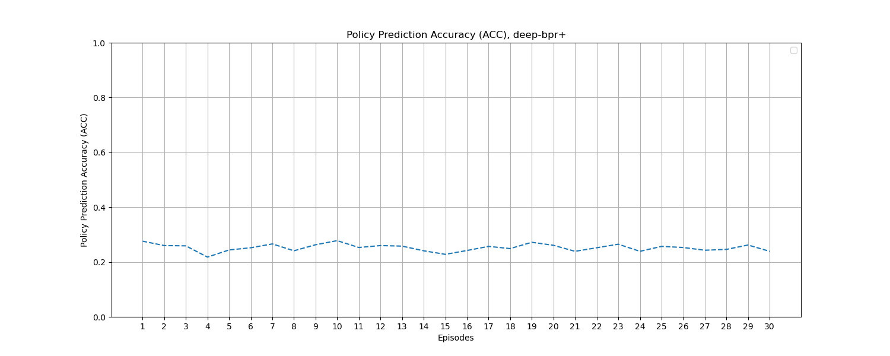

# Experiment 3 Example Figures

!!! tip
    Click the figure to view in fullscreen.

!!! warning
    Please note that the figures presented are based on only 1,000 games, which is a much smaller sample size than the 200,000 games used in the paper. As a result, the figures may not be as precise as those in the paper.

## Figure 7 in the paper

$\tau$ prediction accuracy (ACC) along inter and intra episodes of BSI-PT and the BPR variants against the pitcher with $\omega_{op}$ under different $\epsilon$ values

### $\epsilon=0$

<figure markdown>
  
  <figcaption>BSI-PT's ACC for $\epsilon=0$</figcaption>
</figure>

<figure markdown>
  
  <figcaption>Bayes-OKR's ACC for $\epsilon=0$</figcaption>
</figure>

<figure markdown>
  
  <figcaption>DBPR+'s ACC for $\epsilon=0$</figcaption>
</figure>

<figure markdown>
  
  <figcaption>BPR+'s ACC for $\epsilon=0$</figcaption>
</figure>

### $\epsilon=0.2$

<figure markdown>
  
  <figcaption>BSI-PT's ACC for $\epsilon=0.2$</figcaption>
</figure>

<figure markdown>
  
  <figcaption>Bayes-OKR's ACC for $\epsilon=0.2$</figcaption>
</figure>

<figure markdown>
  
  <figcaption>DBPR+'s ACC for $\epsilon=0.2$</figcaption>
</figure>

<figure markdown>
  
  <figcaption>BPR+'s ACC for $\epsilon=0.2$</figcaption>
</figure>

### $\epsilon=0.5$

<figure markdown>
  
  <figcaption>BSI-PT's ACC for $\epsilon=0.5$</figcaption>
</figure>

<figure markdown>
  
  <figcaption>Bayes-OKR's ACC for $\epsilon=0.5$</figcaption>
</figure>

<figure markdown>
  
  <figcaption>DBPR+'s ACC for $\epsilon=0.5$</figcaption>
</figure>

<figure markdown>
  
  <figcaption>BPR+'s ACC for $\epsilon=0.5$</figcaption>
</figure>

### $\epsilon=1$

<figure markdown>
  
  <figcaption>BSI-PT's ACC for $\epsilon=1$</figcaption>
</figure>

<figure markdown>
  
  <figcaption>Bayes-OKR's ACC for $\epsilon=1$</figcaption>
</figure>

<figure markdown>
  
  <figcaption>DBPR+'s ACC for $\epsilon=1$</figcaption>
</figure>

<figure markdown>
  
  <figcaption>BPR+'s ACC for $\epsilon=1$</figcaption>
</figure>

## Figure 8 in the paper

Winning percentage (WP) along inter and intra episodes of BSI-PT and the BPR variants against the pitcher with $\omega_{op}$ under different $\epsilon$ values

<figure markdown>
  
  <figcaption>Winning percentage (WP) for $\epsilon=0$</figcaption>
</figure>

<figure markdown>
  
  <figcaption>Winning percentage (WP) for $\epsilon=0.2$</figcaption>
</figure>

<figure markdown>
  
  <figcaption>Winning percentage (WP) for $\epsilon=0.5$</figcaption>
</figure>

<figure markdown>
  
  <figcaption>Winning percentage (WP) for $\epsilon=1$</figcaption>
</figure>
